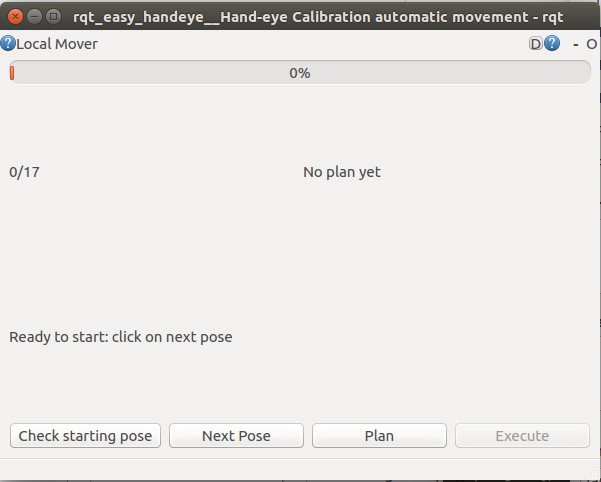
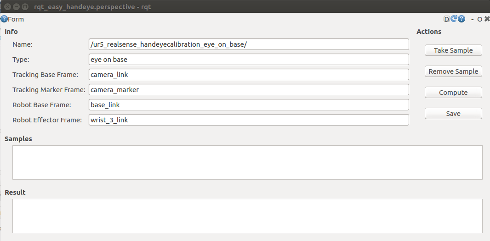
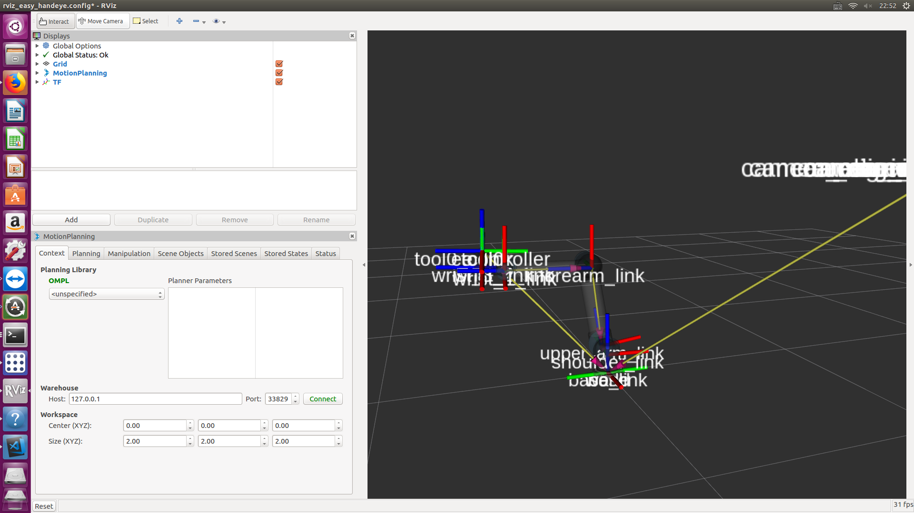
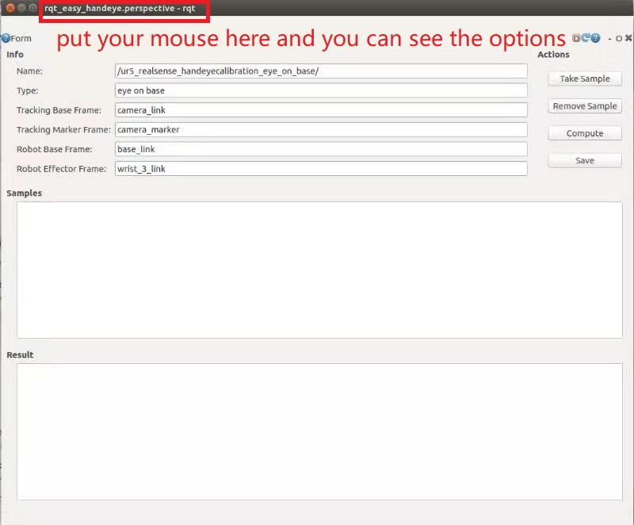
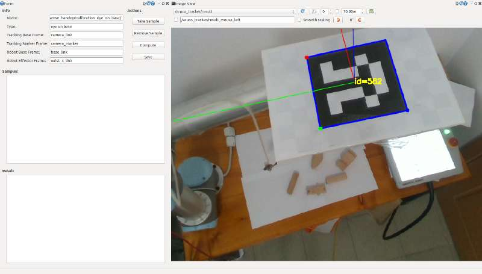
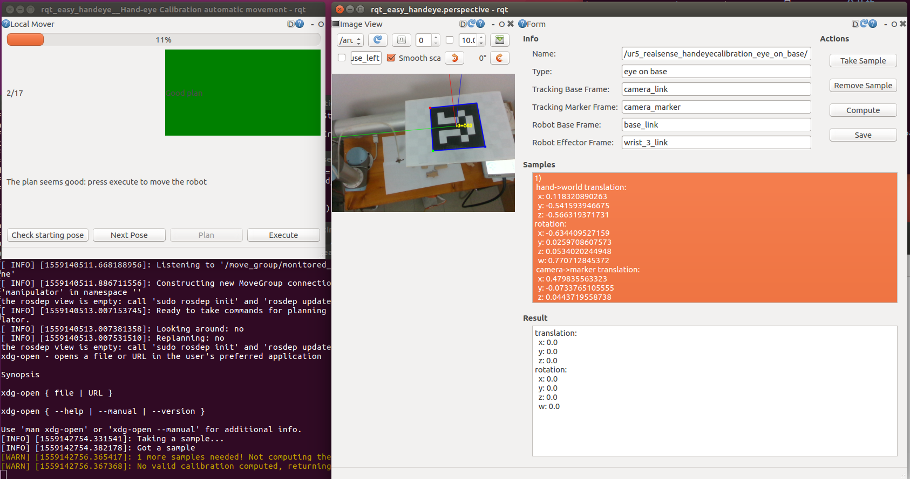
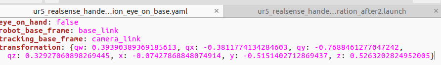
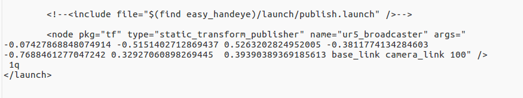
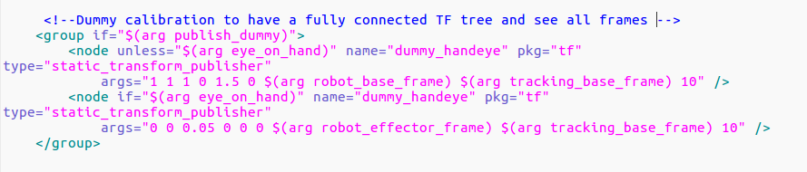

# UR5 REALSENSE CALIBRATION


### Requires

Make sure the following environment:

* ROS kinetic
* MoveIt 
* librealsense & realsense-ros

### Prepare
1. Build catkin workspace

```
mkdir -p ~/catkin_ws/src
cd  ~/catkin_ws
catkin_make
```

2. Install dependence packages:

```
$ sudo apt-get install ros-kinetic-visp
$ sudo apt-get install ros-kinetic-industrial-msgs
$ sudo apt-get install ros-kinetic-ros-control ros-kinetic-ros-controllers
```


3. Download the calibration lib
```
$ cd ~/catkin_ws/src
$ git clone https://github.com/portgasray/ur5_realsense_calibarion.git
```
or
```
$ git clone https://github.com/portgasray/ur5_realsense_calibarion.git
$ cd  ur5_realsense_calibarion
$ git submodule foreach --recursive git submodule init
$ git submodule foreach --recursive git submodule update
```
4. Perform catkin make
```
$ catkin_make
```

:star: Before excuting roslaunch command, you should to preform belowing cmd, **Always remember it !**

```
cd ~/catkin_ws
source ./devel/setup.bash
```
or a convenient way（if you have at least two workspaces, not recommended)
```
$ echo "source ~/catkin_ws/devel/setup.bash" >> ~/.bashrc
$ source ~/.bashrc
```
### Excution

* launch communicaiton with real ur5 robot using IP
```
$ cd ~/catkin_ws
$ roslaunch ur_modern_driver ur5_bringup.launch limited:=true robot_ip:=169.254.6.80
```

* launch moveit 
```
$ cd ~/catkin_ws
$ roslaunch ur5_moveit_config ur5_moveit_planning_execution.launch limited:=true
```
* launch point cloud
```
$ cd ~/catkin_ws
$ roslaunch realsense2_camera rs_rgbd.launch
```
* launch calibration program
```
$ cd ~/catkin_ws
$ roslaunch easy_handeye ur5_realsense_handeyecalibration.launch
```

After that, you will see **three** GUI following(make sure your librealsense was installed at single path and the version accord with environment):

1. 

2. 

3. 

In the GUI window 'rqt_easy_handeye.perspective -rqt': 

Plugins ->  Visualization -> Image View
(you may maximize this window to see the options on the left-top)



select "/aruco_tracker/result" in listbox

Let the  broad in the center of your camera screen



See the Calibrator automatic movement 

Begin start, Pleas slow down the speed of your robot


Click Check starting Pose Button

Take (Next Pose) (Plan) (Excute) (Take Sample) as a loop

** Just remember that, robot move a new pose than Take  Sample **

** If board move out of sight, do not press (Take Sample) button, it may occur bug **

** Plz take more than 8 sample, then press (Compute) button to get 7-element-matrix **

 Save ! Finish!(The .yaml file will save at ~/.ros/easy_handeye/)



You can have a look by publishing your calibration result.

1. Edit launch file and roslaunch it(without close other program window).
 1.1 copy parameters in .yaml to ur5_realsense_handeyecalibration_after2.launch(arg:x,y,z,qx,qy,qz,qw)
 ```
 sudo gedit ~/catkin_ws/src/ur5_realsense_calibarion/easy_handeye/easy_handeye/launch/ur5_realsense_handeyecalibration_after2.launch
 sudo gedit ~/.ros/easy_handeye/ur5_realsense_handeyecalibration_eye_on_base.yaml
 ```
 
 
 
 1.2 now roslaunch the launch file
```
(do not run this command)roslaunch  easy_handeye  publish.launch eye_on_hand:=false namespace_prefix:=ur5_realsense_handeyecalibration
(run this)roslaunch easy_handeye ur5_realsense_handeyecalibration_after2.launch 
```
2.Add TF to see calibration result(in rviz)
 if you find TF flash in rviz
```
sudo gedit ~/catkin_ws/src/ur5_realsense_calibarion/easy_handeye/easy_handeye/launch/calibrate.launch
```
comment out this code patch and re-launch


using easy_handeye publish result

```
roslaunch easy_handeye publish.launch eye_on_hand:=true

```


### Trouble Shooting

1. ERROR: 'module 'catkin_pkg' not found', try command below to install the corresponding package.
```
sudo pip install -U catkin_pkg
```
In case you experience error with command above, you might want to run it without -U option. see [ROSWiki](http://wiki.ros.org/catkin_pkg)
 
2. Revise the content of ur5_realsense_handeyecalibration.launch
[ur5_realsense_handeyecalibration.launch](https://github.com/portgasray/easy_handeye/blob/5ee30dd50f250452cdc56bfe8f4a7597f9d0b6d6/easy_handeye/launch/ur5_realsense_handeyecalibration.launch) in easy_handeye/launch changed for calibration, you may need to revise to yourself. 

3. Built target ddynamic_reconfigure
$ sudo apt-get install ros-kinetic-ddynamic_reconfigure

4. ~/calibration_ws/build/ur5_realsense_calibarion/aruco_ros/aruco_ros/setup_custom_pythonpath.sh: 5: exec: ~/calibration_ws/src/ur5_realsense_calibarion/aruco_ros/aruco_ros/cfg/ArucoThreshold.cfg: Permission denied

```
chmod +x [relevent .cfg]
```
